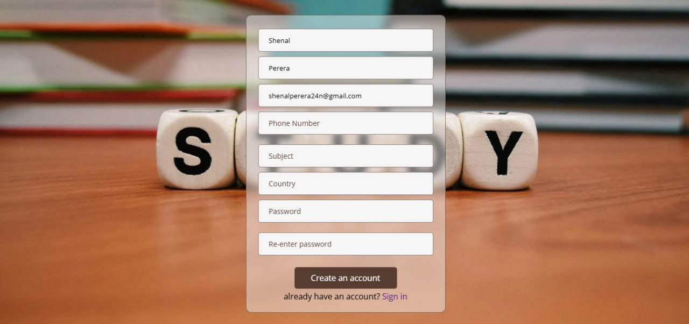
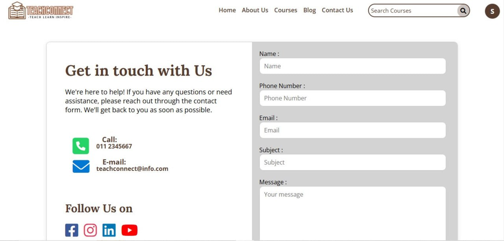

# TeachConnect - Online Teacher Trainer Platform

A comprehensive PHP-based web application designed for managing educator training programs, course enrollment, and educational content delivery.

## 🚀 Quick Start

1. **Clone the repository**
2. **Import the database**: `mysql -u root -p < online_teacher_trainer.sql`
3. **Start PHP server**: `php -S localhost:8000`
4. **Open browser**: `http://localhost:8000/home.php`

That's it! The application is ready to use with sample data included.

## 📸 Project Screenshots

### 🏠 Home Page & Main Interface

<div style="display: flex; gap: 10px;">

  
  

</div>

<details>
<summary>👨‍🏫 Login and Offer Management (Click Here) </summary>

<div style="display: flex; gap: 10px; margin-top: 10px;">
  
  
</div>

</details>


<details>
<summary>👨‍💼 Contact & Teacher course enrollment (Click Here)</summary>

<div style="display: flex; gap: 10px; margin-top: 10px;">
  
  
</div>

</details>


<details>
<summary>🎓 Teacher Trainer content management (Click Here)</summary>


</details>

<details>
<summary>Teacher/ User Dashboard & Teacher Trainer Dashboard</summary>


</details>

<details>
<summary>Payement Management & Admin Dashboard</summary>


</details>


## 🚀 Overview

TeachConnect is a multi-role educational platform that connects administrators, trainers, and students in a unified learning ecosystem. The platform supports course management, blog publishing, feedback systems, and user authentication with role-based access control.

### Key Features
- **Multi-role Authentication**: Admin, Trainer, and Student dashboards
- **Course Management**: Create, update, delete, and enroll in courses
- **Blog System**: Content management for educational articles
- **Feedback & Rating System**: User feedback collection and management
- **Payment Integration**: Course enrollment payment processing
- **Contact Management**: User inquiry handling system

## 🏗️ Architecture

### Database Schema
**Database Name**: `online_teacher_trainer`

#### Core Tables:
- **`trainer`**: Trainer profiles and credentials
- **`teacher`**: Student/teacher user accounts  
- **`admin`**: Administrator accounts
- **`courses`**: Course catalog and metadata
- **`blog_post`**: Blog articles and content
- **`feedback`**: User feedback and ratings
- **`contact_us`**: Contact form submissions

#### Table Relationships:
```
trainer (1) -> (*) courses (via trainer_id)
courses (1) -> (*) enrollments
blog_post (*) -> (1) admin/trainer (author)
feedback (*) -> (1) teacher/trainer (reviewer)
```

## 🛠️ Technical Stack

### Backend
- **Language**: PHP 7.4+
- **Database**: MySQL 5.7+
- **Session Management**: PHP Sessions
- **Password Hashing**: PHP `password_hash()` / `password_verify()`

### Frontend
- **HTML5** with responsive design
- **CSS3** with Flexbox/Grid layouts
- **JavaScript** (Vanilla)
- **Font Awesome** icons
- **Google Fonts** typography

### Dependencies
- **MySQLi Extension**: Database connectivity
- **GD Extension**: Image processing (for uploads)
- **Session Extension**: User authentication

## ⚙️ Installation & Setup

### Prerequisites
```powershell
# Check PHP installation
php --version

# Check MySQL service
Get-Service MySQL*

# Verify required PHP extensions
php -m | Select-String -Pattern "mysqli|gd|session"
```

### 1. Database Setup

The project includes a complete MySQL database file. Database connection is already configured in `config.php` and `conn.php`.

**Requirements:**
- MySQL Server 5.7+
- Database will be named: `online_teacher_trainer`
- Connection: `localhost`, user: `root`, password: (empty)

**Setup Steps:**
```powershell
# 1. Ensure MySQL is running
Get-Service MySQL*

# 2. Import the included database file
mysql -u root -p < online_teacher_trainer.sql

# 3. Verify import success
mysql -u root -p -e "USE online_teacher_trainer; SHOW TABLES;"
```

**Database includes:**
- Complete table structure (users, courses, blog posts, feedback, etc.)
- Sample data for immediate testing
- Pre-configured user accounts

**Note:** Database connection is pre-configured for standard local MySQL setup - no configuration changes needed.

### 2. Environment Configuration
```php
// config.php
<?php
$con = new mysqli("localhost", "root", "", "online_teacher_trainer");
if($con->connect_error) {
    die("Connection failed: " . $con->connect_error);
}
?>

// conn.php  
<?php 
$servername = "localhost";
$username = "root";
$password = "";
$dbname = "online_teacher_trainer";

$conn = new mysqli($servername, $username, $password, $dbname);
if ($conn->connect_error) {
    die("Connection failed: " . $conn->connect_error);
}
?>
```

### 3. Local Development
```powershell
# Navigate to project directory
Set-Location -LiteralPath 'C:\GITHUB PROJECTS'

# Import database (first time setup)
mysql -u root -p < online_teacher_trainer.sql

# Start PHP development server
php -S localhost:8000 -t .

# Open in browser
Start-Process "http://localhost:8000/home.php"
```

### 4. Production Deployment
```powershell
# Example Apache VirtualHost configuration
<VirtualHost *:80>
    DocumentRoot "C:\path\to\project"
    ServerName teachconnect.local
    
    <Directory "C:\path\to\project">
        AllowOverride All
        Require all granted
    </Directory>
</VirtualHost>
```

## 🔐 Security Configuration

### Critical Security Actions Required:
1. **Remove credentials from repository**:
   ```powershell
   # Create .env file (already in .gitignore)
   New-Item -Path ".env" -ItemType File
   ```
   ```env
   DB_HOST=localhost
   DB_USERNAME=root
   DB_PASSWORD=your_secure_password
   DB_NAME=online_teacher_trainer
   ```

2. **Update database connection files**:
   ```php
   // Secure config.php
   <?php
   $con = new mysqli($_ENV['DB_HOST'], $_ENV['DB_USERNAME'], $_ENV['DB_PASSWORD'], $_ENV['DB_NAME']);
   ?>
   ```

3. **SQL Injection Protection**: Most queries use prepared statements ✅
4. **Password Security**: Uses `password_hash()` ✅
5. **Session Security**: Implement HTTPS in production

## 🎯 User Roles & Permissions

### Admin (`admin` table)
- ✅ Full system access
- ✅ User management
- ✅ Course management
- ✅ Blog management
- ✅ Feedback moderation
- 📊 Dashboard: `Admin.php`

### Trainer (`trainer` / `trainer2` tables)
- ✅ Course creation/management
- ✅ Profile management
- ✅ Blog publishing (limited)
- 📊 Dashboard: `Trainer_New/dashboard.php`

### Student/Teacher (`teacher` table)
- ✅ Course enrollment
- ✅ Feedback submission
- ✅ Profile management
- 📊 Dashboard: `student_dashboard.html`

### Code Standards
- Use prepared statements for all database queries
- Validate and sanitize all user inputs
- Follow consistent naming conventions
- Add proper error handling and logging

## 📄 License

This project is licensed under the MIT License. Feel free to use, modify, and distribute as needed.

---

<div align="center">

**⭐ Don't forget to star this repository if you found it helpful! ⭐**


</div>

